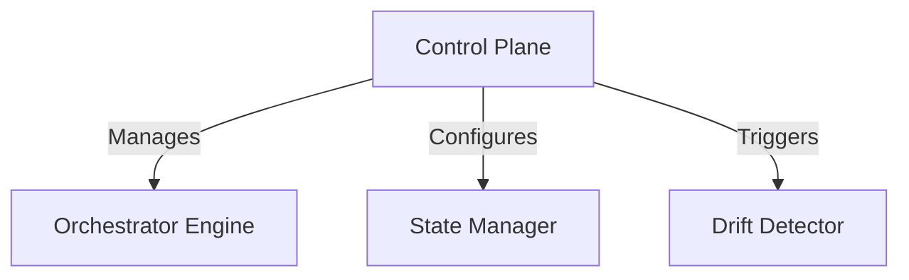
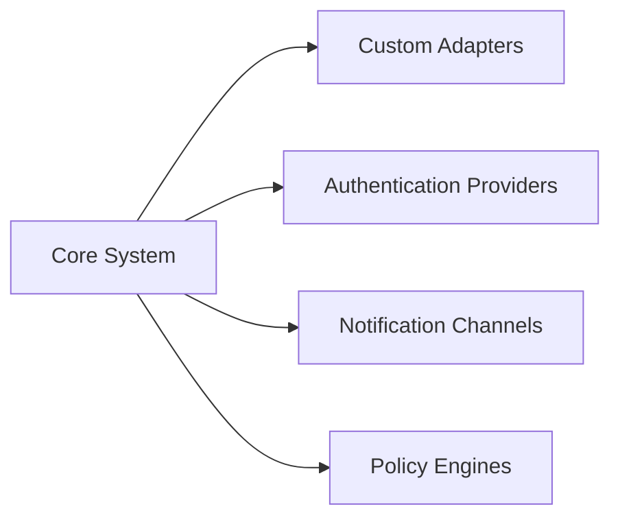

# DeployForge Architecture Overview

## Overview
DeployForge is an intelligent orchestration platform designed to simplify multi-cloud deployments while maintaining infrastructure integrity. Our architecture combines declarative configuration with reactive systems to deliver self-healing capabilities and cloud-agnostic workflows.

*Simplified architectural diagram (Visit [DeployForge Visual Guide](https://example.com/visual-guide) for interactive version)*

## Core Components

### 1. Control Plane
**Purpose**: Central nervous system for deployment operations  
**Key Responsibilities**:
- User/API request processing
- Policy enforcement (RBAC, cost controls, compliance checks)
- Workflow coordination
- Audit logging

### 2. Orchestrator Engine
**Key Features**:
- Cloud-agnostic execution runtime
- Parallel deployment workflows
- Dependency resolution
- Real-time progress streaming

Supports multi-cloud deployment through provider adapters:
- AWS CloudFormation
- Azure Resource Manager
- Google Cloud Deployment Manager
- Terraform (community-maintained)

### 3. State Manager
**Critical Functions**:
- Versioned infrastructure state storage
- Configuration history (diff capabilities)
- Cross-cloud resource inventory
- State encryption at rest/in-transit

### 4. Drift Detector
**Intelligent Monitoring**:
- Continuous configuration scanning
- Behavioral baselining
- Anomaly classification
- Dependency-aware change impact analysis

### 5. Self-Healing Controller
**Autonomous Operations**:
- Policy-driven remediation engine
- Gradual escalation system
  - Auto-retry (transient errors)
  - Configuration rollback
  - Alert escalation
- Machine-learning powered decision engine

### 6. Multi-Cloud Abstraction Layer (MCAL)
**Key Capabilities**:
- Unified resource definition model
- Cloud-specific feature mapping
- Provider credential management
- Network topology abstraction

## Workflow Overview

1. **Declaration**: User submits deployment manifest
2. **Planning**: Orchestrator generates execution plan
3. **Approval**: (Optional) Human-in-the-loop verification
4. **Execution**: Parallel resource provisioning
5. **Verification**: Post-deployment compliance checks
6. **Monitoring**: Continuous state validation begins

## Key Architectural Characteristics

### Stateless Control Plane
- All state externalized to persistent storage
- Horizontal scaling capability
- Zero-downtime upgrades

### Event-Driven Architecture
- Kafka-based event bus
- Guaranteed message delivery
- Ordered processing streams

### Pluggable Extensions

### Security Model
- Zero-trust network design
- Per-operation IAM credentials
- End-to-end audit trail
- Hardware Security Module (HSM) integration

## Self-Healing Process

1. **Detection**: Drift Detector identifies configuration variance
2. **Evaluation**:  
   a. Classify severity (critical/degraded/informational)  
   b. Determine remediation path
3. **Remediation**:  
   a. Automated correction attempt (if within policy)  
   b. Rollback to last known good state  
   c. Resource recreation if unrecoverable
4. **Reporting**:  
   a. Update state manager  
   b. Notify stakeholders  
   c. Create audit trail

The system automatically exempts user-approved changes from healing cycles through our Change Approval API.

> **Performance Note**: Our distributed architecture processes 50,000+ resource checks per minute in benchmark tests, with linear scalability across all components.