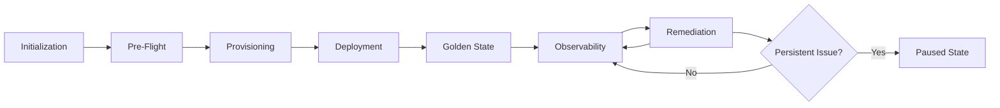

# Deployment Lifecycle in DeployForge

DeployForge orchestrates your infrastructure deployments through a well-defined lifecycle that ensures reliability, consistency, and self-healing across multi-cloud environments. Understanding this flow will help you design robust deployments and troubleshoot effectively.

---

## Lifecycle Overview

Every deployment follows seven key phases:

### 1️. Initialization
- Validates your deployment manifest syntax and cloud provider credentials
- Resolves dynamic variables and secrets
- Generates the execution plan visualization
- *What happens*: DeployForge creates an idempotent session ID to track this deployment through its entire lifecycle.

### 2️. Pre-Flight Checks
- Verifies target environment quotas
- Checks network connectivity between orchestrator and clouds
- Validates infrastructure-as-code templates against provider APIs
- *What happens*: You receive a readiness report with warnings/blockers before any resources are created.

### 3️. Atomic Provisioning
- Creates cloud resources in safe dependency order
- Implements automatic rollback on provisioning failure
- Enforces multi-cloud parity through normalized resource creation
- *What happens*: Resources are created in batches with health checks between stages.

### 4️. Controlled Deployment
- Deploys applications/services to provisioned infrastructure
- Executes canary or blue-green deployments based on routing rules
- Runs post-deployment sanity tests
- *What happens*: Continuous verification ensures services meet SLA thresholds before finalizing.

### 5️. Golden State Declaration
- Captures certified "known good" configuration state
- Stores cloud-agnostic resource signatures in tamper-proof ledger
- *What happens*: This becomes your infrastructure baseline for drift detection.

### 6️. Observability Phase
- Continuous monitoring of:
  - Configuration drift
  - Performance metrics
  - Security compliance
  - Cost anomalies
- *What happens*: Machine learning models analyze telemetry to detect deviations.

### 7️. Auto-Remediation
- Classifies anomalies by severity (info/warning/critical)
- Executes predefined repair workflows
- Escalates unresolved issues through notification channels
- *What happens*: Most common issues are resolved without human intervention.

---

## Lifecycle Transitions

DeployForge manages transitions between phases using a state machine that:

1. Ensures phases execute in strict order  
2. Maintains context between remediation attempts  
3. Preserves forensic data for post-mortem analysis  
4. Supports manual approval gates (when configured)

---

## Special States

When unusual conditions occur, deployments may enter:

**Paused State**  
- Manual intervention required  
- Holds resources in current state for 72 hours  
- Common triggers: Cost threshold exceeded, security violation detected  

**Hibernation State**  
- Retains configuration metadata  
- Tears down expensive compute resources  
- Fast reactivation via `redeploy --resume`  

**Incinerated State**  
- Permanent deletion of all resources and metadata  
- Requires valid "destruction token"  
- Generates final compliance report  

---

## Visualizing the Flow

---

## Key Takeaways

1. The lifecycle ensures infrastructure **converges toward desired state**  
2. Each phase provides automatic recovery mechanisms  
3. Terminal states require explicit user action  
3. Full audit trail maintained for all state transitions  

Use `deployforge lifecycle explain --session-id` to inspect any deployment's complete state history.